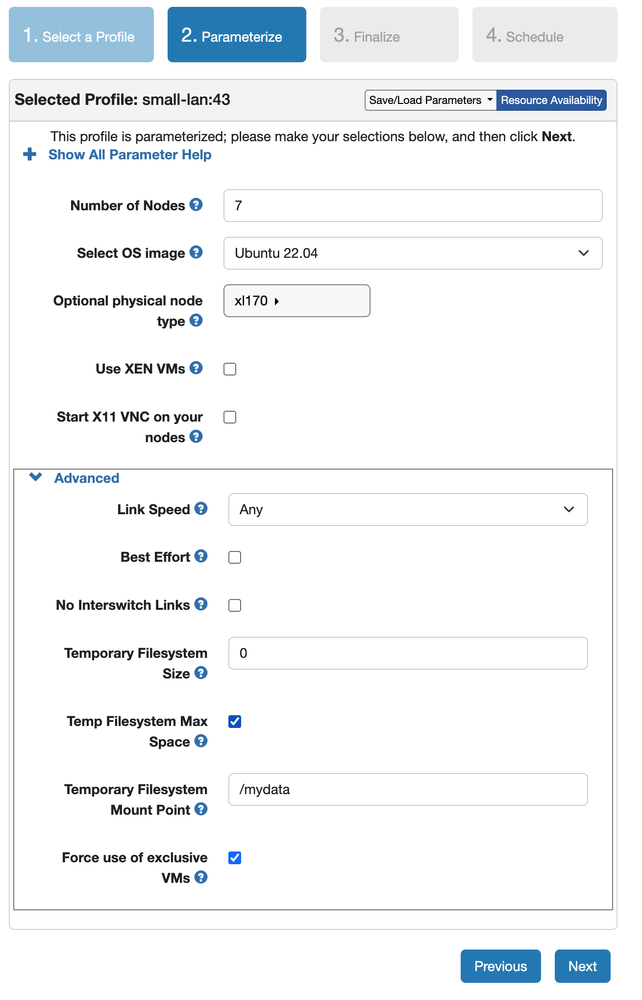

# Artifact Evaluation: A Logically Disaggregated Cache for Replicated Storage Systems

This repository contains the artifact for the paper **"A Logically Disaggregated Cache for Replicated Storage Systems"** (Paper #563). The artifact includes the implementation of LDC in TWIG-KV, an eventually-consistent key-value store with primary-backup replication, along with scripts to run the system.


## Overview

LDC (Logically Disaggregated Cache) is a new architecture for managing embedded caches in replicated storage systems. Instead of each replica managing its cache in a silo, LDC disaggregates the embedded caches to form a single, unified, logical cache. LDC reduces cache redundancy from both reads (via one-sided RDMA to access remote caches) and writes (via selective quick demotions using a tiny queue). An online cost-benefit analyzer (CBA) balances cache coverage and redundancy.

## **Note for artifact evaluators**: 
We have already configured the CloudLab cluster for you. Please add a comment on hotcrp portal so that we can provide access to the cluster. Once you have access to the machines, you can skip directly to [Kick the Tires](#kick-the-tires-artifacts-functional).

## Prerequisites

### Hardware Requirements

- **CloudLab cluster** with **7 nodes** of type **xl170**
  - 3 nodes for servers (replicas)
  - 3 nodes for clients
  - 1 node for the coordinator (one of the server nodes can act as the coordinator if needed)
  - Each node: Intel 10-Core E5-2640v4 CPU, 64GB DRAM, 25Gb Mellanox ConnectX-4 NIC, 480GB SATA SSD

### Software Requirements

- Ubuntu 22.04 LTS (UBUNTU22-64-STD image on CloudLab)
- SSH key access configured on all nodes

## **Note for artifact evaluators**: 
We have already configured the CloudLab cluster for you. Please add a comment so that we can provide access to the cluster. Once you have access to the machines, you can skip directly to [Kick the Tires](#kick-the-tires-artifacts-functional). If you want to run the experiment on your own cluster, please follow the instructions below to setup the cluster.

## Build Source Code 

### Step 0: Setup CloudLab Cluster

Create a CloudLab experiment using the profile **small-lan** with the following parameters:



- **Number of Nodes**: 7
- **OS Image**: Ubuntu 22.04
- **Physical Node Type**: xl170
- **Temp Filesystem Max Space**: checked
- **Temporary Filesystem Mount Point**: `/mydata`

Click **Next**, then **Finalize**, and **Schedule** the experiment.

### Step 1: Configure Username

All scripts share a single configuration file. Edit `setup/env.sh` and set the username:

```bash
# setup/env.sh
USERNAME_RAW="<username>"
```

### Step 2: Configure CloudLab Cluster

Copy your CloudLab manifest XML (found under "Manifest" when viewing the experiment) to the config directory:

```bash
cp your_cloudlab_manifest.xml config/cloudlab_machines.xml
```

### Step 3: Initialize and Compile

```bash
cd setup/

# Install dependencies and set up all nodes (runs on all cluster nodes via SSH)
./init.sh

# IMPORTANT: Reboot all hosts in CloudLab before continuing

# Compile and deploy to all nodes
./init_compile.sh
```

This will:
- Install all dependencies (Machnet, RDMA libraries, Cap'n Proto, etc.) on every node
- Compile the TWIG-KV binary and deploy it to `/mnt/sda4/LDC/build` on all nodes

### Step 4: Generate YCSB Workloads

```bash
./create_ycsb_workload.sh
```

This generates YCSB traces for uniform, hotspot (80/20), and zipfian (0.99) distributions in `/mydata/ycsb_traces/` and `/mydata/ycsb/`.

## Kick the Tires (Artifacts Functional)

The main root directory for the artifact is `/mydata/LDC/`.

### Configure the environment

```bash
cd /mydata/LDC/setup/
./eval_init.sh
```

### Configure Username

All scripts share a single configuration file. Edit `setup/env.sh` and set the provided username (eg. reviewer1):

```bash
# setup/env.sh
USERNAME_RAW="<username>"
```

### Running Experiments

we run the following experiments:
 - Cache Size: 10% and 33.4% of the dataset
 - Workload Pattern: Uniform and Zipfian
 - System: Baseline and LDC

To run both the baseline and LDC systems, run the following script:

```bash
cd setup/
./run_all.sh
```

To run only the baseline system, run the following script:

```bash
cd setup/
./run_baseline.sh
```

To run only the LDC system, run the following script:

```bash
cd setup/
./run_LDC.sh
```

To select the type of workload to run, go into the script of the system you want to run and at the end of the script, you will see the following:

```bash
CACHE_SIZE=(0.10 0.334)
uniform
zipfian_0.99
```
Change the CACHE_SIZE to the cache size you want to run it in the fraction of the dataset.
To select the pattern of the workload, comment out the other workload patterns and uncomment the workload pattern you want to run. By default, both uniform and zipfian_0.99 are run.

Results are stored under `setup/results/` organized by workload type (e.g., `results/uniform/`, `results/zipfian_0.99/`).

Note: the experimient failures are handled by the script and the script will try to run the experiment again after it times out. 

If the experiment is taking too long (more than 45 minutes), please run the kill the process on the control node.
to kill the process on the server and client nodes use `setup/kill_ldc.sh`.


### Analyzing Results

After experiments complete, use the analysis scripts to generate plots:

```bash
cd setup/
python compare_systems.py
```

This will generate the plots in the `setup/plots/` directory.

the plots are:
 - throughput.png (throughput vs cache size)
 - latency.png (latency vs cache size)
 - similarity.png (similarity vs cache size)
 - data_coverage.png (data coverage vs cache size)


### Cluster information of the setup provided to Evaluators

3 client nodes:
- Node 0: 10.10.1.1
- Node 1: 10.10.1.2
- Node 2: 10.10.1.3

3 server nodes:
- Node 3: 10.10.1.4
- Node 4: 10.10.1.5
- Node 5: 10.10.1.6

Coordinator node:
- Node 11: 10.10.1.12

Reserved for fault tolerance. not used in the experiment nodes
- Node 6: 10.10.1.7
- Node 7: 10.10.1.8
- Node 8: 10.10.1.9
- Node 9: 10.10.1.10
- Node 10: 10.10.1.11

to check the logs of each node run the following command:
```bash
cd /mnt/sda4/LDC/setup/
tail -f run.log
```